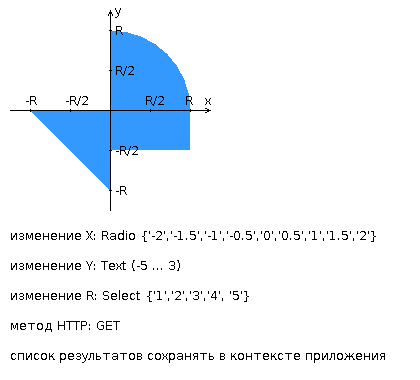

   <picture>
      
   </picture>
   <h1 align="center">Лабораторная работа №2</h1>
   <h2 align="center">Варинат №118273</h2>

<!-- Here are some cool labels for your project, delete those, that you don't need -->

   
   
   

### Текст задания

Разработать веб-приложение на базе сервлетов и JSP, определяющее попадание точки на координатной плоскости в заданную область.

Приложение должно быть реализовано в соответствии с [шаблоном MVC](https://en.wikipedia.org/wiki/Model%E2%80%93view%E2%80%93controller) и состоять из следующих элементов:
- **ControllerServlet**, определяющий тип запроса, и, в зависимости от того, содержит ли запрос информацию о координатах точки и радиусе, делегирующий его обработку одному из перечисленных ниже компонентов. Все запросы внутри приложения должны передаваться этому сервлету (по методу GET или POST в зависимости от варианта задания), остальные сервлеты с веб-страниц напрямую вызываться не должны.
- **AreaCheckServlet**, осуществляющий проверку попадания точки в область на координатной плоскости и формирующий HTML-страницу с результатами проверки. Должен обрабатывать все запросы, содержащие сведения о координатах точки и радиусе области.
- **Страница** JSP, формирующая HTML-страницу с веб-формой. Должна обрабатывать все запросы, не содержащие сведений о координатах точки и радиусе области.

**Разработанная страница JSP должна содержать:**

1. "Шапку", содержащую ФИО студента, номер группы и номер варианта.
2. Форму, отправляющую данные на сервер.
3. Набор полей для задания координат точки и радиуса области в соответствии с вариантом задания.
4. Сценарий на языке JavaScript, осуществляющий валидацию значений, вводимых пользователем в поля формы.
5. Интерактивный элемент, содержащий изображение области на координатной плоскости (в соответствии с вариантом задания) и реализующий следующую функциональность:
   - Если радиус области установлен, клик курсором мыши по изображению должен обрабатываться JavaScript-функцией, определяющей координаты точки, по которой кликнул пользователь и отправляющей полученные координаты на сервер для проверки факта попадания.
   - В противном случае, после клика по картинке должно выводиться сообщение о невозможности определения координат точки.
   - После проверки факта попадания точки в область изображение должно быть обновлено с учётом результатов этой проверки (т.е., на нём должна появиться новая точка).
   - Таблицу с результатами предыдущих проверок. Список результатов должен браться из контекста приложения, HTTP-сессии или Bean-компонента в зависимости от варианта.
6. Страница, возвращаемая AreaCheckServlet, должна содержать:

Таблицу, содержащую полученные параметры.
Результат вычислений - факт попадания или непопадания точки в область.
Ссылку на страницу с веб-формой для формирования нового запроса.
Разработанное веб-приложение необходимо развернуть на сервере WildFly. Сервер должен быть запущен в standalone-конфигурации, порты должны быть настроены в соответствии с выданным portbase, доступ к http listener'у должен быть открыт для всех IP.

   

