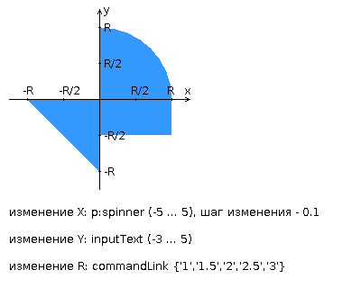

<!-- Here is the main logo and name of your project -->

   <picture>
      
   </picture>
   <h1 align="center">Лабораторная работа №3</h1>
   <h2 align="center">Варинат №1337</h2>

<!-- Here are some cool labels for your project, delete those, that you don't need -->

   
   
   
   

### Текст задания

Разработать приложение на базе JavaServer Faces Framework, которое осуществляет проверку попадания точки в заданную область на координатной плоскости.

Приложение должно включать в себя 2 facelets-шаблона - стартовую страницу и основную страницу приложения, а также набор управляемых бинов (managed beans), реализующих логику на стороне сервера.

**Стартовая страница должна содержать следующие элементы:**

- "Шапку", содержащую ФИО студента, номер группы и номер варианта.
- Интерактивные часы, показывающие текущие дату и время, обновляющиеся раз в 6 секунд.
- Ссылку, позволяющую перейти на основную страницу приложения.

**Основная страница приложения должна содержать следующие элементы:**

- Набор компонентов для задания координат точки и радиуса области в соответствии с вариантом задания. Может потребоваться использование дополнительных библиотек компонентов - [ICEfaces](http://www.icesoft.org/java/projects/ICEfaces/overview.jsf) (префикс "ace") и [PrimeFaces](http://www.primefaces.org/) (префикс "p"). Если компонент допускает ввод заведомо некорректных данных (таких, например, как буквы в координатах точки или отрицательный радиус), то приложение должно осуществлять их валидацию.
- Динамически обновляемую картинку, изображающую область на координатной плоскости в соответствии с номером варианта и точки, координаты которых были заданы пользователем. Клик по картинке должен инициировать сценарий, осуществляющий определение координат новой точки и отправку их на сервер для проверки её попадания в область. Цвет точек должен зависить от факта попадания / непопадания в область. Смена радиуса также должна инициировать перерисовку картинки.
- Таблицу со списком результатов предыдущих проверок.
- Ссылку, позволяющую вернуться на стартовую страницу.

**Дополнительные требования к приложению:**

- Все результаты проверки должны сохраняться в базе данных под управлением СУБД Oracle.
- Для доступа к БД необходимо использовать ORM Hibernate.
- Для управления списком результатов должен использоваться Application-scoped Managed Bean.
- Конфигурация управляемых бинов должна быть задана с помощью аннотаций.
- Правила навигации между страницами приложения должны быть заданы в отдельном конфигурационном файле.

   

