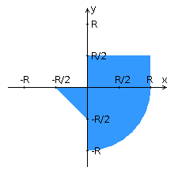

<!-- Here is the main logo and name of your project -->

   <picture>
      
   </picture>
   <h1 align="center">Лабораторная работа №4</h1>
   <h2 align="center">Варинат №824362</h2>

<!-- Here are some cool labels for your project, delete those, that you don't need -->

    
    
    
    
    

### Текст задания

Переписать приложение из [предыдущей лабораторной работы](../lab3) с использованием следующих технологий:

- Уровень back-end должен быть основан на Spring.
- Уровень front-end должен быть построен на [Angular 2+](https://angular.io/) с использованием набора компонентов [PrimeNG](https://www.primefaces.org/primeng/#/)
- Взаимодействие между уровнями back-end и front-end должно быть организовано посредством REST API.

Приложение по-прежнему должно включать в себя 2 страницы - стартовую и основную страницу приложения. Обе страницы приложения должны быть адаптированы для отображения в 3 режимах:

- "Десктопный" - для устройств, ширина экрана которых равна или превышает 1182 пикселей.
- "Планшетный" - для устройств, ширина экрана которых равна или превышает 839, но меньше 1182 пикселей.
- "Мобильный"- для устройств, ширина экрана которых меньше 839 пикселей.

**Стартовая страница должна содержать следующие элементы:**

- "Шапку", содержащую ФИО студента, номер группы и номер варианта.
- Форму для ввода логина и пароля. Информация о зарегистрированных в системе пользователях должна храниться в отдельной таблице БД (пароль должен храниться в виде хэш-суммы). Доступ неавторизованных пользователей к основной странице приложения должен быть запрещён.

**Основная страница приложения должна содержать следующие элементы:**

- Набор полей ввода для задания координат точки и радиуса области в соответствии с вариантом задания: `Listbox {'-2','-1.5','-1','-0.5','0','0.5','1','1.5','2'}` для координаты по оси X, `Slider (-3 ... 5)` для координаты по оси Y, и `Listbox {'-2','-1.5','-1','-0.5','0','0.5','1','1.5','2'}` для задания радиуса области. Если поле ввода допускает ввод заведомо некорректных данных (таких, например, как буквы в координатах точки или отрицательный радиус), то приложение должно осуществлять их валидацию.
- Динамически обновляемую картинку, изображающую область на координатной плоскости в соответствии с номером варианта и точки, координаты которых были заданы пользователем. Клик по картинке должен инициировать сценарий, осуществляющий определение координат новой точки и отправку их на сервер для проверки её попадания в область. Цвет точек должен зависить от факта попадания / непопадания в область. Смена радиуса также должна инициировать перерисовку картинки.
- Таблицу со списком результатов предыдущих проверок.
- Кнопку, по которой аутентифицированный пользователь может закрыть свою сессию и вернуться на стартовую страницу приложения.

**Дополнительные требования к приложению:**

- Все результаты проверки должны сохраняться в базе данных под управлением СУБД Oracle.
- Для доступа к БД необходимо использовать Spring Data.

   

